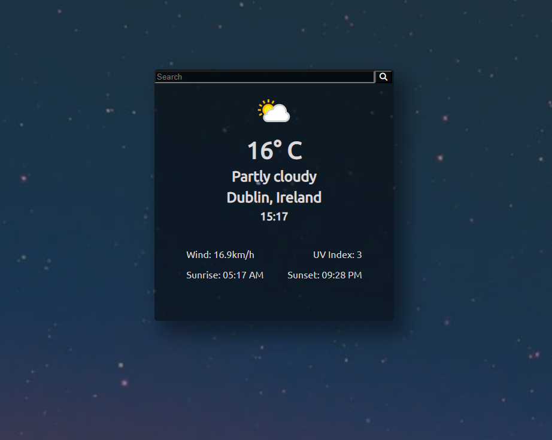

# Weather APP
I created this mini project to practice the use of APIs. The app fetches data from weatherAPI.com and updates the information on the page. I am using unsplash to generate background images by sending the input location and the current weather condition (example: Dublin, cloudy). Some pictures are better match than others. This project was created to practice fetching data from APIs and manipulating the returned data. The API key was removed from the main js file. In future I would like to further add to this project by storing the API key on the back end.  

Handling errors

